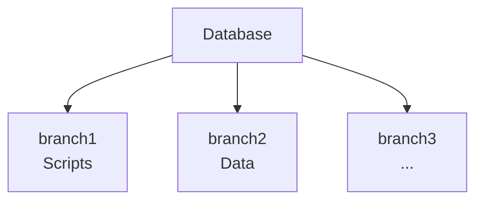
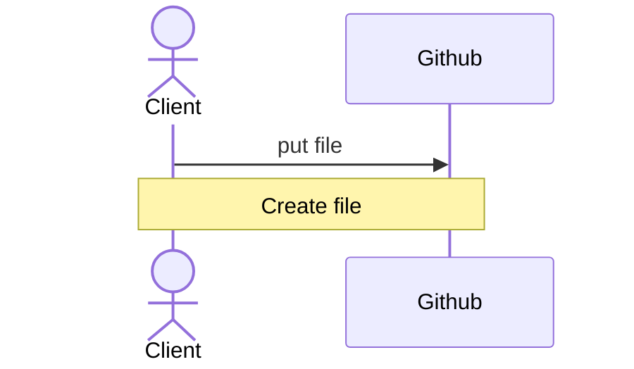
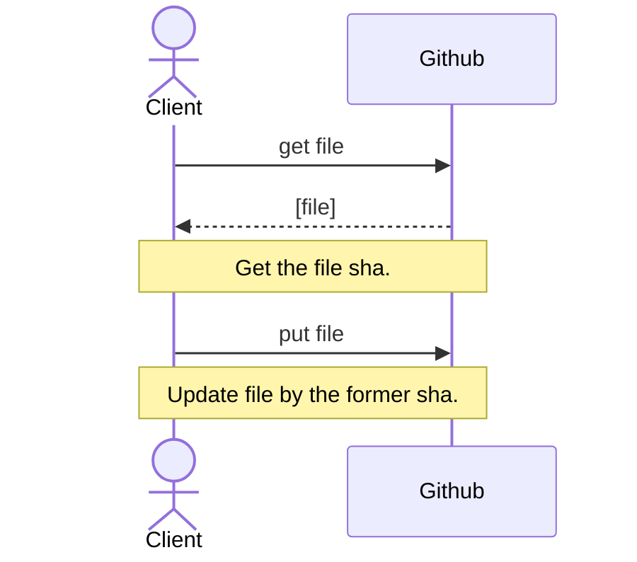

# Github Database


## 简介

Github Database是一个将GitHub的仓库作为数据库的解决方案。

**⚠️ 这个方案被用于网页时含有一定风险。** [详细内容](#safety-warning)

***

一些建议：
- 使用分支



------------------

## 运行与维护

### 前期准备

1. 创建一个Private仓库（下称“DB仓库”），用作你的DB仓库。
2. 创建一个Fine-grained personal access token（下称“DB token”），并仅赋予它访问DB仓库的权限。
    - 你应赋予DB token对于DB仓库的读写权限。
    - 如果你不需要使用DB仓库的Actions等功能可以不赋予DB token其它权限。
        - [创建个人访问令牌——GitHub Docs](
https://docs.github.com/zh/authentication/keeping-your-account-and-data-secure/creating-a-personal-access-token)

这样，我们就完成了建立数据库的前期准备。

### DB仓库的读写

有两种方式可以实现对这个DB仓库的读写：

- 使用[Octokit](https://github.com/octokit)完成对DB仓库的读写
- 使用GitHub api完成对DB仓库的读写
- ~~通过各种奇技淫巧完成对DB仓库的读写~~

**值得注意的是，Octokit在钉钉内置的浏览器中表现不佳。** 因此，如果要开发在钉钉浏览器内也能运行的网站，我们推荐直接使用Github api。

如果使用GitHub api，则可以通过如下的方式对DB仓库进行读写：

Create file:


Update file:



<span id="safety-warning">

## 安全

**请注意到此为止我们的前提假设都是这个DB仓库工作在一个写入量不大的环境**，比如一个个人博客。

### ⚠️ 风险警示

**✅ 这个方案可以被安全的用于编译后的程序——前提是你为这些编译好的程序进行了加密处理。** 你可以将你的DB token直接写入程序，然后加密它，从而避免被反编译导致DB token泄露。如果加密整个程序有困难，你可以编写一个只用于读写DB仓库的程序，然后对其进行高强度加密。

**⚠️ 这个方案被用于网页时含有一定风险。** 没有后端意味着这个数据库没有办法完成一些只有后端才能完成的操作，比如身份的认证。

当这个DB仓库工作于一些所有人都有写入权限的环境时（比如一个评论区），这意味着你不得不将具有写入权限的DB token存放在网页的某个位置，以使前端得以正常操作DB仓库。但是，当DB token被别有用心的人找到后，他们可能使用其来恶意查看/修改你的DB仓库。

### 一些应对方案

大多数黑客的攻击行为都是为了利益——无论是为了钱财，还是仅仅为了出名。

因此，当你的项目的读写需求不大时，它大概率不会被黑客注意到。即使你仍有所担心，你还可以通过下面的方法降低你的DB token被发现的概率：

- 不公布你的数据库解决方案，不要透露哪怕一个字，并假装你花钱办置了后端。
- 对你的JS代码、你的DB token进行混淆加密。例如：

    <details>
    <summary>初始代码：</summary>

    ```Javascript
    // base64 encoded
    var token = "dfghjkjdhstxgdshxjuhygDRFGYHBDFGYHUJNSBVGYHBDgvbhJNHvvUDHBJmgGHjBh"
    ...
    function updateDB(){
        fetch("https://api.github.com/repos/{ Owner }/{ Repo }/contents/" + fileName, {
            method: "put",
            headers: {
                Authorization: "token " + b64DecodeUnicode(token),
                Accept: "application/vnd.github.v3+json"
            },
            body: ...,
        });
    }
    ```
    </details>

    <details>
    <summary>加密后：</summary>

    ```
    // Magic. Do not touch.
    [][(![]+[])[!+[]+!![]+!![]]+([]+{})[+!![]]+(!![]+[])[+!![]]+(!![]+[])[+[]]][([]+{})[!+[]+!![]+!![]+!![]+!![]]+([]+{})[+!![]]+([][[]]+[])[+!![]]+(![]+[])[!+[]+!![]+!![]]+(!![]+[])[+[]]+(!![]+[])[+!![]]+([][[]]+[])[+[]]+([]+{})[!+[]+!![]+!![]+!![]+!![]]+(!![]+[])[+[]]+([]+{})[+!![]]+(!![]+[])[+!![]]](([]+[][(![]+[])[!+[]+!![]+!![]]+([]+...//（太长了，后略）
    ```
    </details>

[一个加密工具的链接](https://www.sojson.com/jsfuck.html)

下面是一些止损的方法：

- 建立数个不同的DB仓库的方式来进一步降低可能的损失。
- **所有的DB token都不应被授予admin权限**，以免DB仓库遭到删除。
