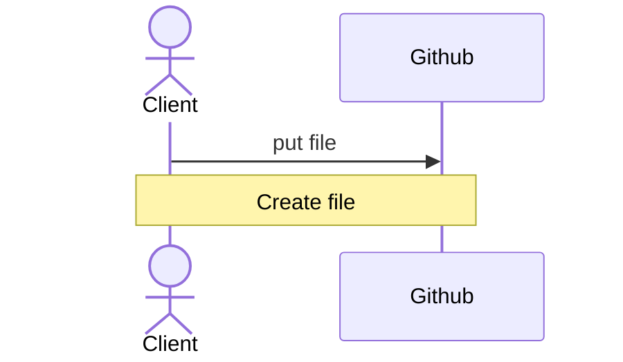
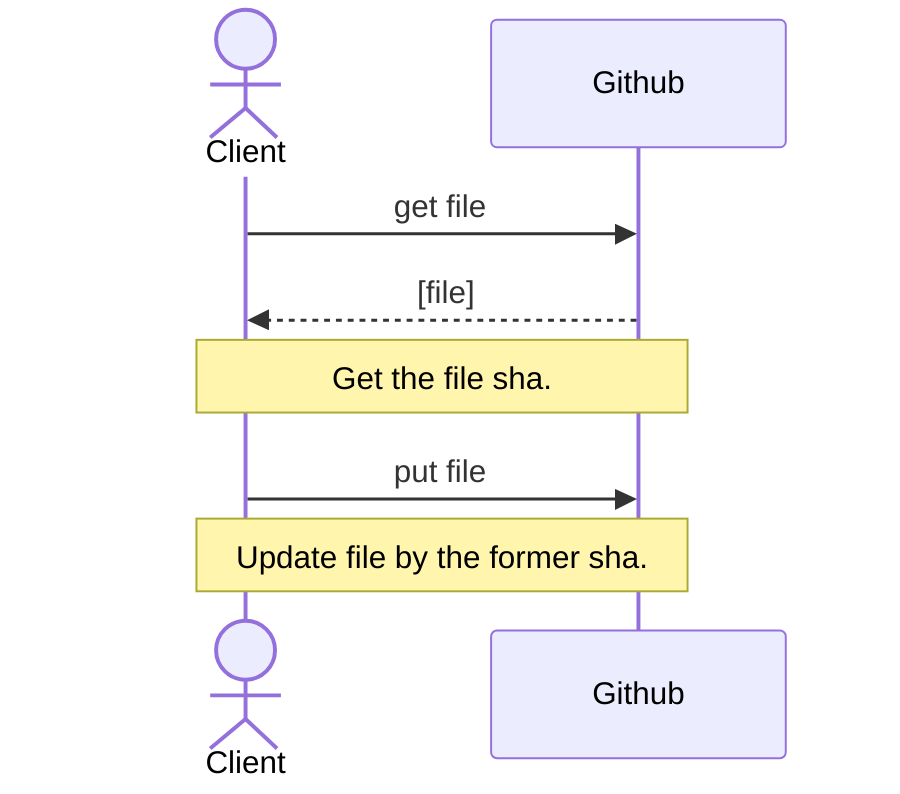

# Github Database

[简体中文](README.md)


## Introduction

Github Database is a solution that uses Github's Repository as a database.

This scheme allows us to complete some simple database operations with **a small amount of writing** when there is no backend, such as leaving messages and commenting on web pages; Register users, etc.

### Warning

**The read and write volume (especially the write volume) of the database cannot be too large**.

**⚠️  There are certain risks when this scheme is used for web pages**. [View details](#safety-warning)

### Principle

Github provides tools such as Github api and Octokit to help us manage and control the Repository hosted on GitHub.

Therefore, we can update the database by submitting Push to the Repository in GitHub, and complete some operations that can be completed by the backend by running GitHub Actions.

## Operation and maintenance

### Preliminary preparation

1. Create a private Repository (hereinafter referred to as "DB Repository") to use as your DB Repository.

2. Create a fine-grained personal access token (hereinafter referred to as "DB token") and only grant it access to the DB Repository.

- [Create a personal access token - Github Docs](https://docs.github.com/zh/authentication/keeping-your-account-and-data-secure/creating-a-personal-access-token)
- You should give the DB token read and write permissions to the DB Repository.
- If you need to use the Github Actions function of the DB Repository, you can give the DB token relevant permissions on Actions.
- **The DB token should not be given other unused permissions**.

In this way, we have completed the preliminary preparation for the establishment of the database.

### Read and write of DB Repository

There are two ways to read and write to this DB Repository:

- Use [Octokit](https://github.com/octokit) to read and write to the DB Repository

- Use Github api to read and write to the DB Repository

- ~~Read and write to the DB Repository through various ingenious techniques~~

**It is worth noting that Octokit does not perform well in the browser built into the Dingtalk**. Therefore, if you want to develop a website that can also run in the Dingtalk browser, we recommend using the Github api directly.

If you use the Github api, you can read and write to the DB Repository in the following ways:

Create file:


Update file:

<span id="safety-warning">

## Security

**Please note that our premise so far is that the DB Repository works in an environment with small write volume**, such as a personal blog.

###  ⚠️  Web page risk warning

**✅  This scheme can be safely used for compiled programs - provided that you encrypt these compiled programs**. You can write your DB token directly into the program, and then encrypt it, so as to avoid the DB token leakage caused by decompilation. If it is difficult to encrypt the whole program, you can write a program that is only used to read and write the database Repository, and then encrypt it with high strength.

**⚠️  There are certain risks when this scheme is used for web pages**. The lack of a backend means that the database cannot complete some operations that only the backend can complete, such as identity authentication.

When the DB Repository works in an environment where everyone has write permission (such as a comment area), it means that you have to store the DB token with write permission in a certain location on the web page to enable the front-end to operate the DB Repository normally. However, when the DB token is found by people with ulterior motives, they may use it to maliciously view/modify your DB Repository.

#### Some solutions

Most hackers attack for profit - whether for money or just for fame.
Therefore, when the reading and writing requirements of your project are not large, it will probably not be noticed by hackers. Even if you are still worried, you can also reduce the probability of your DB token being found by the following methods:

- Never publish your database solution, don't disclose even one word, and pretend that you have spent money on the back-end.
- Confuse and encrypt your JS code and your DB token. For example:
    
    <details>
    <summary>Initial code:</summary>
    
    ```Javascript
    // base64 encoded
    var token = "dfghjkjdhstxgdshxjuhygDRFGYHBDFGYHUJNSBVGYHBDgvbhJNHvvUDHBJmgGHjBh"
    ...
    function updateDB(){
        fetch("https://api.github.com/repos/{ Owner }/{ Repo }/contents/" + fileName, {
            method: "put",
            headers: {
                Authorization: "token " + b64DecodeUnicode(token),
                Accept: "application/vnd.github.v3+json"
            },
            body: ...,
        });
    }
    ```
    </details>
    
    <details>
    <summary>After encryption:</summary>
    
    ```
    // Magic. Do not touch.
    [][(![]+[])[!+[]+!![]+!![]]+([]+{})[+!![]]+(!![]+[])[+!![]]+(!![]+[])[+[]]][([]+{})[!+[]+!![]+!![]+!![]+!![]]+([]+{})[+!![]]+([][[]]+[])[+!![]]+(![]+[])[!+[]+!![]+!![]]+(!![]+[])[+[]]+(!![]+[])[+!![]]+([][[]]+[])[+[]]+([]+{})[!+[]+!![]+!![]+!![]+!![]]+(!![]+[])[+[]]+([]+{})[+!![]]+(!![]+[])[+!![]]](([]+[][(![]+[])[!+[]+!![]+!![]]+([]+...//(Too long, omit after)
    ```
    </details>
[Link to an encryption tool](https://www.sojson.com/jsfuck.html)

Here are some stop-loss methods:

- Establish several different DB Repositorys to further reduce possible losses.
- **All DB tokens should not be granted admin permission** to avoid deleting the DB Repository.

### User information

We **do not recommend** to use this scheme as a database for **storing website user information**.

The user's password should not be stored directly in your DB repository. For the sake of security, the password stored in the DB Repository should be the HASH value of the user password after being processed by the salt adding algorithm.